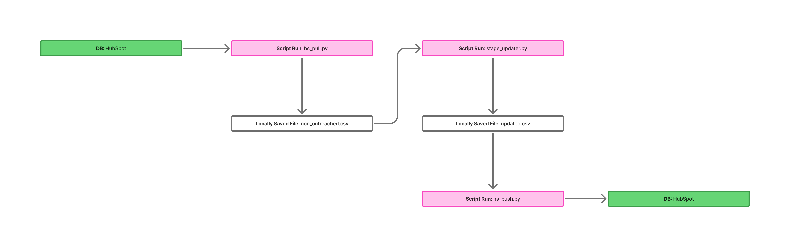

# Stage Updater

## Overview
The **Stage Updater** is a Python-based pipeline for automating the process of updating lead stages in HubSpot. It pulls data, processes it, and pushes the updates back to HubSpot. The automation ensures efficient tracking of outreach efforts, reducing manual updates and improving data integrity.

## File Structure
```
stage_updater/
│── data/
│   ├── data.csv
│   ├── linkedin_outreach_results.csv
│   ├── non_outreached.csv
│   ├── temp_data.csv
│
│── output/
│   ├── linkedin_outreach_results.csv
│
│── scripts/
│   ├── hs_funcs.py
│   ├── hs_pull.py
│   ├── hs_push.py
│   ├── hs_update.py
│   ├── stage_updater.py
│
│── media/
│   ├── stage_updater_flow.jpeg
│
│── .gitignore
```

## Workflow
The Stage Updater follows a structured pipeline:

1. **Data Pull**: `hs_pull.py` fetches lead data from HubSpot and saves it as `non_outreached.csv`.
2. **Data Processing**: `stage_updater.py` updates the lead statuses and generates `updated.csv`.
3. **Data Push**: `hs_push.py` uploads the updated records back into HubSpot.

### Flowchart
Below is a visual representation of the process:



## Script Descriptions

- **`hs_funcs.py`**: Contains helper functions used across the scripts.
- **`hs_pull.py`**: Pulls lead data from HubSpot and saves it as a CSV file.
- **`stage_updater.py`**: Processes the data and updates lead statuses.
- **`hs_push.py`**: Pushes the processed data back into HubSpot.
- **`hs_update.py`**: Additional update logic (if needed).

## Installation & Usage

### Prerequisites
- Python 3.x
- `pandas`
- `requests`
- HubSpot API Key (stored securely)

### Setup
1. Clone the repository:
   ```sh
   git clone https://github.com/tom-youngblood/stage_updater.git
   cd stage_updater
   ```

2. Install dependencies:
pip install -r requirements.txt

3. Configure your API key in an .env file:
echo "HUBSPOT_API_KEY=your_api_key_here" > .env

## Running the Pipeline
  ```sh
  python scripts/hs_pull.py   # Fetch data from HubSpot
  python scripts/stage_updater.py  # Process and update data
  python scripts/hs_push.py   # Push updated data back to HubSpot
  ```
